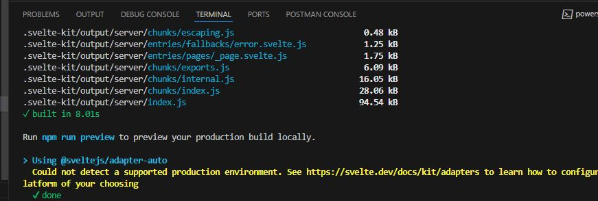
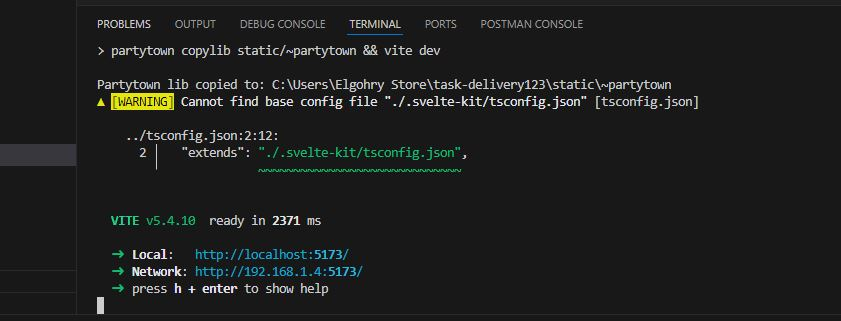
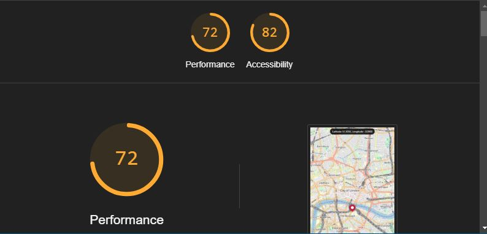
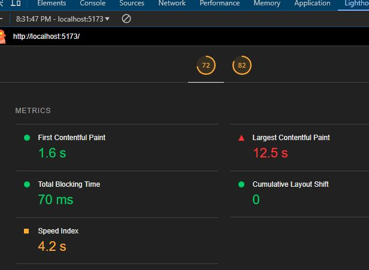

# **Performance Considerations**

## Table of Contents
| Section | Description |
| ----------- | ----------- |
| [Metrics](#metrics)| Performance output numbers. |
| [Mobile Performance](#mobile-performance)| mobile performance. |
| [Performance Optimizations](#performance-optimizations)| performance optimizations on the application. |

---
---

## Metrics
- Initial load time: < 4s
- Smooth marker dragging on mobile devices.

*Console log time metrics.*

## Mobile Performance
1. Lowered map tile quality on slow connections
2. Smoothed position updates while dragging the marker
3. Improved touch interaction
---

### Performance Optimizations

#### 1. Debouncing
Added a debounce to limit how often the location gets saved while dragging the marker. This cuts down on unnecessary updates and keeps performance smooth.

#### 2. Asynchronous Loading with PartyTown
PartyTown to handle tasks, which lightened the main thread’s load and boosted responsiveness and performance.

### Performance Test
Used the Lighthouse tool to test the performance of the application.

*Lighthouse score showing performance metrics.*

